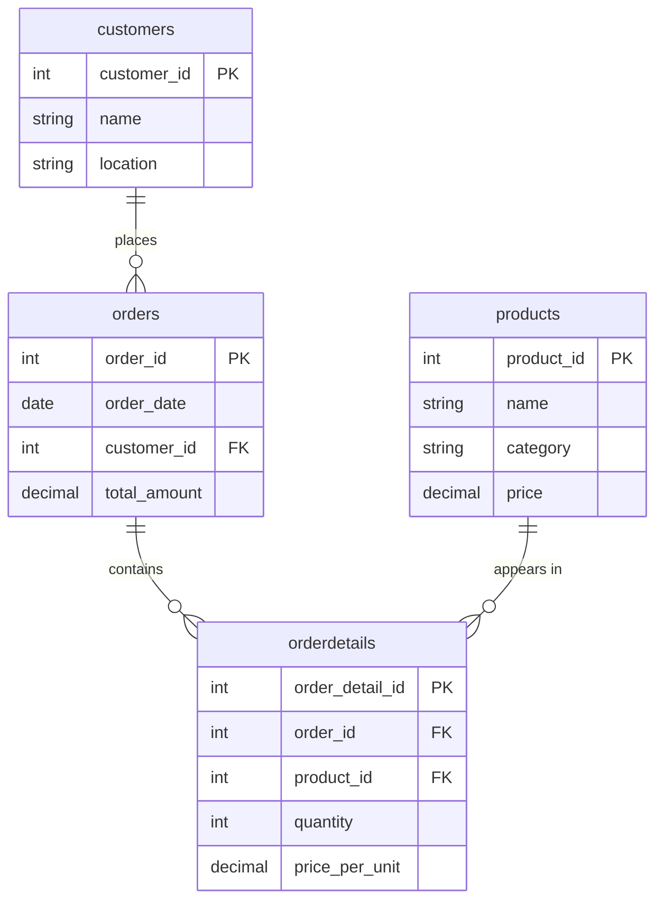

# 🛒 E-Commerce Sales Analysis — SQL Project

Business-focused SQL analysis of a multi-city e-commerce company's customer, product, and order data — built to answer real questions a growth or ops team would actually ask: *where are our customers, what's driving revenue, and where is growth slowing down?*


---

## 📌 Overview

This project models a relational e-commerce database from raw source data (`customers`, `products`, `orders`, `orderdetails`), loads it into a normalized MySQL schema, and answers 15+ business questions using pure SQL — covering customer segmentation, product performance, sales trends, and growth analysis.

**Why this project:** Anyone can write a `SELECT * FROM table`. This project is built to show the SQL skills that actually matter — window functions for trend analysis, CTEs for readable multi-step logic, correct JOIN/GROUP BY reasoning, and translating raw query output into a plain-English business recommendation.

---

## 🗂️ Dataset

Source data: 100 customers, 8 products, 200 orders, and 519 order line items spanning **March 2023 – February 2024**.

| Table | Rows | Description |
|---|---|---|
| `customers` | 100 | Customer ID, name, and city |
| `products` | 8 | Product ID, name, category, and price |
| `orders` | 200 | One row per order — date, customer, total amount |
| `orderdetails` | 519 | Line items per order — product, quantity, price at time of sale |

**Data Dictionary**

<details>
<summary>Click to expand column-level detail</summary>

**customers**
| Column | Type | Notes |
|---|---|---|
| customer_id | INT, PK | Unique customer identifier |
| name | VARCHAR | Customer full name |
| location | VARCHAR | City (10 distinct cities in the dataset) |

**products**
| Column | Type | Notes |
|---|---|---|
| product_id | INT, PK | Unique product identifier |
| name | VARCHAR | Product name |
| category | VARCHAR | Electronics / Wearable Tech / Photography |
| price | DECIMAL | List price |

**orders**
| Column | Type | Notes |
|---|---|---|
| order_id | INT, PK | Unique order identifier |
| order_date | DATE | Date the order was placed |
| customer_id | INT, FK → customers | Who placed the order |
| total_amount | DECIMAL | Total value of the order |

**orderdetails**
| Column | Type | Notes |
|---|---|---|
| order_detail_id | INT, PK | Surrogate key (see note below) |
| order_id | INT, FK → orders | Parent order |
| product_id | INT, FK → products | Product purchased |
| quantity | INT | Units purchased in this line item |
| price_per_unit | DECIMAL | Unit price at time of sale |

</details>

> **Data quality note:** `(order_id, product_id)` is *not* a unique combination — 62 orders contain the same product added as separate line items, so `orderdetails` uses a surrogate primary key (`order_detail_id`) rather than a composite one. This was caught during EDA before writing the schema and is exactly the kind of thing worth checking before assuming a "natural key" exists.

---

## 🧩 Entity Relationship Diagram



---

## 📁 Project Structure

```
ecommerce-sql-analysis/
│
├── README.md                      ← you are here
├── data/                          ← raw data, cleaned to CSV
│   ├── customers.csv
│   ├── products.csv
│   ├── orders.csv
│   └── orderdetails.csv
├── sql/
│   ├── 01_schema.sql               ← table definitions, keys, indexes
│   ├── 02_seed_data.sql            ← INSERT statements to load data/
│   └── 03_business_queries.sql     ← all analysis queries + inline insights
└── docs/
    └── interview_questions.md      ← Q&A prep based on this project
```

---

## ▶️ How to Run

1. Create the database and tables:
   ```bash
   mysql -u root -p < sql/01_schema.sql
   ```
2. Load the seed data:
   ```bash
   mysql -u root -p ecommerce_analysis < sql/02_seed_data.sql
   ```
3. Run the analysis:
   ```bash
   mysql -u root -p ecommerce_analysis < sql/03_business_queries.sql
   ```

Written and tested for **MySQL 8.0+** (uses `LAG()` window functions and CTEs). Adjust `DATE_FORMAT`/`DATEDIFF` calls if porting to PostgreSQL or SQLite.

---

## ❓ Business Questions Answered

All queries live in [`sql/03_business_queries.sql`](sql/03_business_queries.sql), each with the SQL, the result, and a written takeaway. Full list:

1. Top 3 cities by customer count — key markets for marketing & logistics
2. Customer order-frequency distribution (engagement depth)
3. Customer engagement segmentation (One-Time / Repeat / Loyal)
4. Premium product trend — high revenue at moderate order quantity
5. Unique customers reached per product category
6. Month-on-month % change in total sales
7. Month with the largest sales decline
8. Month-on-month average order value (AOV) trend
9. Product turnover / sales velocity ranking
10. Products purchased by less than 40% of the customer base
11. Month-on-month customer base growth rate
12. Months with the highest sales volume

---

## 💡 Key Insights & Recommendations

| # | Finding | Recommendation |
|---|---|---|
| 1 | **Delhi, Chennai, and Jaipur** account for ~42% of all customers | Prioritize these three cities in marketing spend and regional stock allocation |
| 2 | 52% of active customers are **Repeat Buyers** (2–3 orders); only 17% are **Loyal** (4+) | Build a loyalty/retention program specifically targeting the Repeat segment to push them into Loyal |
| 3 | **Electronics** reaches 79/100 customers vs. 45 for Photography | Keep Electronics as the anchor category; use it to cross-sell Photography and Wearable Tech |
| 4 | Laptop and Digital SLR Camera drive outsized revenue from high **unit price**, not order volume | Protect margins with premium positioning rather than discount-led promotions on these SKUs |
| 5 | Total sales swing wildly month to month (+147% to −75%) with **Sep, Dec, and Jul 2023** as peaks | Investigate what drove Sep/Jul (repeatable campaigns?) and plan inventory/staffing around Dec seasonality |
| 6 | Average order value climbed from ₹60.7K to a ₹132.1K peak in Dec 2023 | Basket size is growing — lean into bundling/upsell offers, especially around Q4 |
| 7 | New customer acquisition is **decelerating sharply** — 70% of all-time buyers joined in the first 5 months | Growth is not self-sustaining; acquisition spend needs to increase to avoid a flattening customer base |
| 8 | **Smartphone 6″** and **Wireless Earbuds** reach under 40% of customers | Review pricing/positioning — possible mismatch between stock levels and actual demand |

**Headline numbers:** ₹1.98 Cr total revenue · ₹98,915 average order value · 84 of 100 customers (84%) have placed at least one order.

> **Caveat:** February 2024 is the final month in the dataset and shows the sharpest decline (−74.5%). This is very likely a *partial month* of data rather than a genuine demand collapse, and should be excluded (or annotated) before being used to justify any real business decision — a good example of reading trend data critically rather than at face value.

---

## 🛠️ Tech Stack

- **SQL** — MySQL 8.0 (CTEs, window functions: `LAG()`, `SUM() OVER`)
- **Python / pandas** — used only for source-data cleaning and validation before writing the schema (not part of the analysis itself)

---

## 🎯 Conclusion

This project turns a raw four-table e-commerce export into a set of decisions a real business could act on: **which cities to invest marketing in, which customers are at risk of churn, which products carry the business, and why revenue growth is slowing down.** Every query in this repo pairs a technical SQL technique — CTEs, window functions, conditional aggregation — with a plain-English "so what," because a query result on its own isn't an insight until it changes what someone would do next.

If you're reviewing this as a hiring manager or interviewer: I'm happy to walk through the reasoning behind any query, extend the analysis (cohort retention, RFM segmentation, and customer lifetime value are natural next steps), or adapt the schema to a different SQL dialect on request.

---

## 📬 Contact

**Rajnath Vishwakarma**
[Linkedin](https://www.linkedin.com/in/rajnath-vishwakarma-b412b62a5/) · [Email](mailto:rajnath2410@gmail.com)
